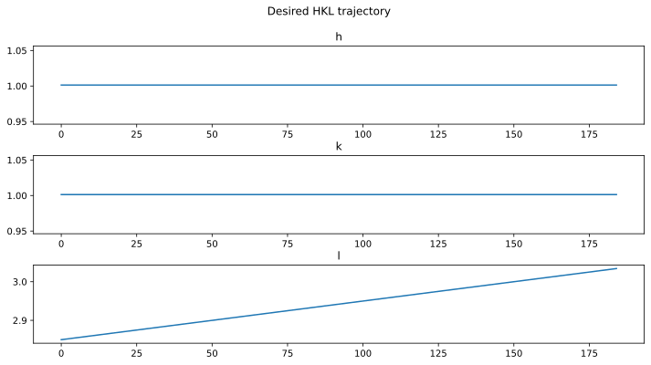

Compare E4CV 4-circle orientation with SPEC fourc
=================================================

Following the E4CV example (consult the example for geometry details),
compare the orientation matix and positioning operations with *hklpy*
(and *libhkl*) and *SPEC*.

Information from a SPEC data file will be used for the comparison.

--------------

Note: This example is available as a `Jupyter
notebook <https://jupyter.org/>`__ from the *hklpy* source code website:
https://github.com/bluesky/hklpy/tree/main/examples

In SPEC *fourc* geometry (https://certif.com/spec_help/fourc.html):

====== ======== ======================
name   mnemonic description
====== ======== ======================
2theta tth      Detector arm rotation
Omega  om       Rotates sample circles
Chi    chi      Sample tilt
Phi    phi      Sample rotation
====== ======== ======================

The provided SPEC data file names these motors: ``tth``, ``th``,
``chi``, ``phi`` so this example will use the same names to help the
comparison.

.. code:: ipython3

    # mapping of axis names between hklpy and SPEC
    AXIS_NAME_MAP = dict(
        # E4CV  fourc
        tth='tth',   # Detector arm rotation
        omega='th',  # Rotates chi around horizontal axis
        chi='chi',   # Rotates phi around beam axis
        phi='phi',   # Sample rotation around horizontal axis (when phi is co-linear with omega)
    )

Read the SPEC scan from the data file
-------------------------------------

The SPEC file provides all the information needed here. The
`spec2nexus <https://github.com/prjemian/spec2nexus>`__ (python) package
can read the file and parse the content into useful structures,
including deducing the diffractometer geometry in many cases.

.. code:: ipython3

    import pyRestTable
    from spec2nexus.spec import SpecDataFile
    
    specfile = SpecDataFile("resources/LNO_LAO_s14.dat")
    specscan = specfile.getScan(14)
    
    spec_d = specscan.diffractometer
    spec_d.UB = spec_d.geometry_parameters["ub_matrix"][2]
    
    terms = {
        "SPEC file": specfile.specFile,
        "scan #": specscan.scanNum,
        "SPEC scanCmd": specscan.scanCmd,
        "geometry": spec_d.geometry_name,
        "mode": spec_d.mode,
        "lattice": spec_d.lattice,
        "wavelength": spec_d.wavelength,
        "reflection 1": spec_d.reflections[0],
        "reflection 2": spec_d.reflections[1],
        "[UB]": spec_d.UB,
    }
    tbl = pyRestTable.Table()
    tbl.labels = "term value".split()
    for k, v in terms.items():
        tbl.addRow((k, v))
    print(tbl)

.. parsed-literal::

    ============ =======================================================================================================================================================
    term         value                                                                                                                                                  
    ============ =======================================================================================================================================================
    SPEC file    LNO_LAO                                                                                                                                                
    scan #       14                                                                                                                                                     
    SPEC scanCmd hklscan  1.00133 1.00133  1.00133 1.00133  2.85 3.05  200 -400000                                                                                      
    geometry     fourc                                                                                                                                                  
    mode         Omega equals zero                                                                                                                                      
    lattice      LatticeParameters(a=3.781726143, b=3.791444574, c=3.79890313, alpha=90.2546203, beta=90.01815424, gamma=89.89967858)                                   
    wavelength   1.239424258                                                                                                                                            
    reflection 1 Reflections(h=0.0, k=0.0, l=2.0, wavelength=1.239424258, angles=OrderedDict([('tth', 38.09875), ('th', 19.1335), ('chi', 90.0135), ('phi', 0.0)]))     
    reflection 2 Reflections(h=1.0, k=1.0, l=3.0, wavelength=1.239424258, angles=OrderedDict([('tth', 65.644), ('th', 32.82125), ('chi', 115.23625), ('phi', 48.1315)]))
    [UB]         [[-1.65871244e+00  9.82002413e-02 -3.89705578e-04]                                                                                                     
                  [-9.55499031e-02 -1.65427863e+00  2.42844486e-03]                                                                                                     
                  [ 2.62981891e-04  9.81574682e-03  1.65396181e+00]]                                                                                                    
    ============ =======================================================================================================================================================
    

Plot the (*hkl*) trajectories in the scan
-----------------------------------------

.. code:: ipython3

    %matplotlib inline
    
    import numpy as np
    import matplotlib.pyplot as plt
    
    # plot the h, k, & l vs. point number
    fig, axes = plt.subplots(3, 1, figsize=(12, 6))
    fig.subplots_adjust(hspace=0.4, wspace=0.2)
    
    plt.suptitle('Desired HKL trajectory')
    axes[0].plot(specscan.data["H"])
    axes[0].set_title("h")
    axes[1].plot(specscan.data["K"])
    axes[1].set_title("k")
    axes[2].plot(specscan.data["L"])
    axes[2].set_title("l")
    plt.show()

Setup the *E4CV* diffractometer in *hklpy*
------------------------------------------

.. code:: ipython3

    import gi
    gi.require_version('Hkl', '5.0')
    from hkl.diffract import E4CV
    from hkl.util import Lattice
    
    from ophyd import (PseudoSingle, SoftPositioner)
    from ophyd import Component as Cpt

.. code:: ipython3

    class Diffractometer(E4CV):
        h = Cpt(PseudoSingle, '')
        k = Cpt(PseudoSingle, '')
        l = Cpt(PseudoSingle, '')
    
        # use the SPEC axis names here
        th = Cpt(SoftPositioner)
        chi = Cpt(SoftPositioner)
        phi = Cpt(SoftPositioner)
        tth = Cpt(SoftPositioner)
    
        def __init__(self, *args, **kwargs):
            super().__init__(*args, **kwargs)
    
            for p in self.real_positioners:
                p._set_position(0)  # give each a starting position

.. code:: ipython3

    fourc = Diffractometer("", name="fourc")
    fourc.calc.physical_axis_names = {
        # E4CV: local
        'omega': 'th',
        'chi': 'chi',
        'phi': 'phi',
        'tth': 'tth',
        }

.. code:: ipython3

    # add the sample to the calculation engine
    fourc.calc.new_sample(
        specfile.specFile,
        lattice=Lattice(
            a=spec_d.lattice.a, 
            b=spec_d.lattice.b, 
            c=spec_d.lattice.c,
            alpha=spec_d.lattice.alpha, 
            beta=spec_d.lattice.beta, 
            gamma=spec_d.lattice.gamma)
        )

.. parsed-literal::

    HklSample(name='LNO_LAO', lattice=LatticeTuple(a=3.781726143, b=3.791444574, c=3.79890313, alpha=90.2546203, beta=90.01815424, gamma=89.89967858), ux=Parameter(name='None (internally: ux)', limits=(min=-180.0, max=180.0), value=0.0, fit=True, inverted=False, units='Degree'), uy=Parameter(name='None (internally: uy)', limits=(min=-180.0, max=180.0), value=0.0, fit=True, inverted=False, units='Degree'), uz=Parameter(name='None (internally: uz)', limits=(min=-180.0, max=180.0), value=0.0, fit=True, inverted=False, units='Degree'), U=array([[1., 0., 0.],
           [0., 1., 0.],
           [0., 0., 1.]]), UB=array([[ 1.66146225e+00, -2.89938471e-03,  5.11196668e-04],
           [ 0.00000000e+00,  1.65721725e+00,  7.34922202e-03],
           [ 0.00000000e+00,  0.00000000e+00,  1.65394723e+00]]), reflections=[])

Test *hklpy* with the UB orientation matrix from *SPEC*
-------------------------------------------------------

Set the UB matrix as provided in the SPEC data file.

.. code:: ipython3

    # get the UB matrix from the SPEC data
    # SPEC's UB first row moved (via numpy slicing) to last row for hklpy
    fourc.UB.put(spec_d.UB[[1,2,0], :])
    print(spec_d.UB)
    print(fourc.UB.get())
    
    # calculate angles with hklpy using the SPEC UB matrix
    fourc.engine.mode = "bissector"
    fourc.calc["phi"].limits = (-50, 100)
    fourc.calc["tth"].limits = (-2, 180)
    print("(002) :", fourc.forward((0, 0, 2)))
    print("(113) :", fourc.forward((1, 1, 3)))

.. parsed-literal::

    [[-1.65871244e+00  9.82002413e-02 -3.89705578e-04]
     [-9.55499031e-02 -1.65427863e+00  2.42844486e-03]
     [ 2.62981891e-04  9.81574682e-03  1.65396181e+00]]
    [[-9.55499053e-02 -1.65427875e+00  2.42825603e-03]
     [ 2.63161907e-04  9.81566638e-03  1.65396189e+00]
     [-1.65871254e+00  9.82003048e-02 -3.89644168e-04]]
    (002) : PosCalcE4CV(th=23.915206114844626, chi=89.91480547663566, phi=99.11611601380724, tth=47.83041222968925)
    (113) : PosCalcE4CV(th=42.33129428600627, chi=115.20291094237979, phi=48.133061440101486, tth=84.66258857201254)

Define a custom repoting function to format the output table.

.. code:: ipython3

    def add_ref_to_table(tbl, r):
        sol = fourc.forward((r.h, r.k, r.l))
        nm = f"{r.h:.0f} {r.k:.0f} {r.l:.0f}"
        for sm in AXIS_NAME_MAP.values():
            row = [f"({nm})", sm]
            row.append(f"{getattr(sol, sm):.5f}")
            row.append(f"{r.angles[sm]:.5f}")
            tbl.addRow(row)

For each of the orientation reflections used in the SPEC file, report
the computed motor positions for each reflection for E4CV and SPEC.

In this case, the two reflections cannot be reached if the same
diffractometer is used for both. Set the mode for each reflection.

.. code:: ipython3

    # Compare these angles with those from SPEC
    tbl = pyRestTable.Table()
    tbl.labels = "(hkl) motor E4CV SPEC".split()
    r1, r2 = spec_d.reflections
    fourc.calc["tth"].limits = (-2, 180)
    
    fourc.engine.mode = "constant_phi"
    fourc.phi.move(0)
    add_ref_to_table(tbl, r1)
    
    fourc.engine.mode = "bissector"
    add_ref_to_table(tbl, r2)
    
    print(tbl)

.. parsed-literal::

    ======= ===== ========= =========
    (hkl)   motor E4CV      SPEC     
    ======= ===== ========= =========
    (0 0 2) tth   47.83041  38.09875 
    (0 0 2) th    23.99932  19.13350 
    (0 0 2) chi   90.01350  90.01350 
    (0 0 2) phi   0.00000   0.00000  
    (1 1 3) tth   84.66259  65.64400 
    (1 1 3) th    42.33129  32.82125 
    (1 1 3) chi   115.20291 115.23625
    (1 1 3) phi   48.13306  48.13150 
    ======= ===== ========= =========
    

Setup the UB orientation matrix using *hklpy*
---------------------------------------------

Compute the UB matrix using *hklpy* (& *libhkl*).

.. code:: ipython3

    fourc.calc.wavelength = 1.239424258 # Angstrom
    
    refs = [
        fourc.calc.sample.add_reflection(
            r.h, r.k, r.l, 
            position=fourc.calc.Position(
                tth=r.angles["tth"],
                th=r.angles["th"],
                chi=r.angles["chi"],
                phi=r.angles["phi"],
            )
        )
        for r in spec_d.reflections
    ]
    
    fourc.calc.sample.compute_UB(*refs)
    
    tbl = pyRestTable.Table()
    tbl.labels = "term value".split()
    tbl.addRow(("SPEC [UB]", spec_d.UB))
    tbl.addRow(("E4CV [UB]", fourc.UB.get()))
    print(tbl)

.. parsed-literal::

    ========= ===================================================
    term      value                                              
    ========= ===================================================
    SPEC [UB] [[-1.65871244e+00  9.82002413e-02 -3.89705578e-04] 
               [-9.55499031e-02 -1.65427863e+00  2.42844486e-03] 
               [ 2.62981891e-04  9.81574682e-03  1.65396181e+00]]
    E4CV [UB] [[-9.55498634e-02 -1.65427875e+00  2.42844498e-03] 
               [ 2.63111155e-04  9.81585901e-03  1.65396189e+00] 
               [-1.65871254e+00  9.82002627e-02 -3.89705597e-04]]
    ========= ===================================================
    

Report the results, as before, and compare with table above.

.. code:: ipython3

    tbl = pyRestTable.Table()
    tbl.labels = "term value".split()
    tbl.addRow(("energy, keV", fourc.calc.energy))
    tbl.addRow(("wavelength, angstrom", fourc.calc.wavelength))
    tbl.addRow(("position", fourc.position))
    tbl.addRow(("sample name", fourc.sample_name.get()))
    tbl.addRow(("[U]", fourc.U.get()))
    tbl.addRow(("[UB]", fourc.UB.get()))
    tbl.addRow(("lattice", fourc.lattice.get()))
    print(tbl)
    
    print(f"sample\t{fourc.calc.sample}")

.. parsed-literal::

    ==================== =========================================================================
    term                 value                                                                    
    ==================== =========================================================================
    energy, keV          10.00337045202483                                                        
    wavelength, angstrom 1.239424258                                                              
    position             DiffractometerPseudoPos(h=-0.0, k=0.0, l=0.0)                            
    sample name          LNO_LAO                                                                  
    [U]                  [[-5.75094968e-02 -9.98327391e-01  5.92267768e-03]                       
                          [ 1.58361191e-04  5.92337392e-03  9.99982444e-01]                       
                          [-9.98344947e-01  5.75094251e-02 -1.82553939e-04]]                      
    [UB]                 [[-9.55498634e-02 -1.65427875e+00  2.42844498e-03]                       
                          [ 2.63111155e-04  9.81585901e-03  1.65396189e+00]                       
                          [-1.65871254e+00  9.82002627e-02 -3.89705597e-04]]                      
    lattice              [ 3.78172593  3.7914443   3.79890295 90.25465556 90.01815877 89.89967654]
    ==================== =========================================================================
    
    sample	HklSample(name='LNO_LAO', lattice=LatticeTuple(a=3.781725931569308, b=3.79144430103082, c=3.798902949497184, alpha=90.25465555509926, beta=90.01815876717824, gamma=89.89967653973522), ux=Parameter(name='None (internally: ux)', limits=(min=-180.0, max=180.0), value=-90.01045975373877, fit=True, inverted=False, units='Degree'), uy=Parameter(name='None (internally: uy)', limits=(min=-180.0, max=180.0), value=0.3393464183946019, fit=True, inverted=False, units='Degree'), uz=Parameter(name='None (internally: uz)', limits=(min=-180.0, max=180.0), value=93.2969283549115, fit=True, inverted=False, units='Degree'), U=array([[-5.75094968e-02, -9.98327391e-01,  5.92267768e-03],
           [ 1.58361191e-04,  5.92337392e-03,  9.99982444e-01],
           [-9.98344947e-01,  5.75094251e-02, -1.82553939e-04]]), UB=array([[-9.55498634e-02, -1.65427875e+00,  2.42844498e-03],
           [ 2.63111155e-04,  9.81585901e-03,  1.65396189e+00],
           [-1.65871254e+00,  9.82002627e-02, -3.89705597e-04]]), reflections=[(h=0.0, k=0.0, l=2.0), (h=1.0, k=1.0, l=3.0)], reflection_measured_angles=array([[0.        , 0.44139322],
           [0.44139322, 0.        ]]), reflection_theoretical_angles=array([[0.        , 0.44081129],
           [0.44081129, 0.        ]]))

.. code:: ipython3

    # Compare these angles with those from SPEC
    # fourc.calc["phi"].limits = (-1, 100)
    tbl = pyRestTable.Table()
    tbl.labels = "(hkl) motor E4CV SPEC".split()
    r1, r2 = spec_d.reflections
    fourc.calc["tth"].limits = (-2, 180)
    
    fourc.engine.mode = "constant_phi"
    fourc.phi.move(0)
    add_ref_to_table(tbl, r1)
    
    fourc.engine.mode = "bissector"
    add_ref_to_table(tbl, r2)
    
    print(tbl)

.. parsed-literal::

    ======= ===== ========= =========
    (hkl)   motor E4CV      SPEC     
    ======= ===== ========= =========
    (0 0 2) tth   38.08407  38.09875 
    (0 0 2) th    19.12616  19.13350 
    (0 0 2) chi   90.01350  90.01350 
    (0 0 2) phi   0.00000   0.00000  
    (1 1 3) tth   65.63700  65.64400 
    (1 1 3) th    32.81850  32.82125 
    (1 1 3) chi   115.20291 115.23625
    (1 1 3) phi   48.13305  48.13150 
    ======= ===== ========= =========
    

