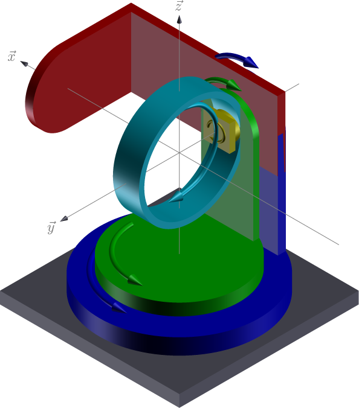
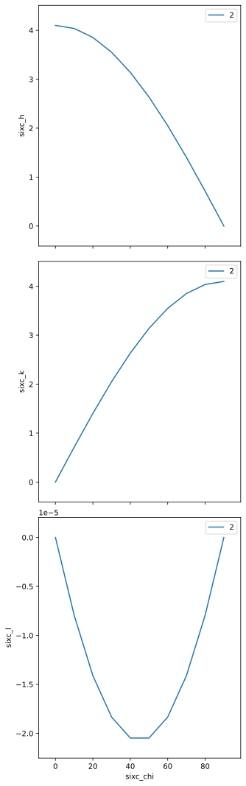
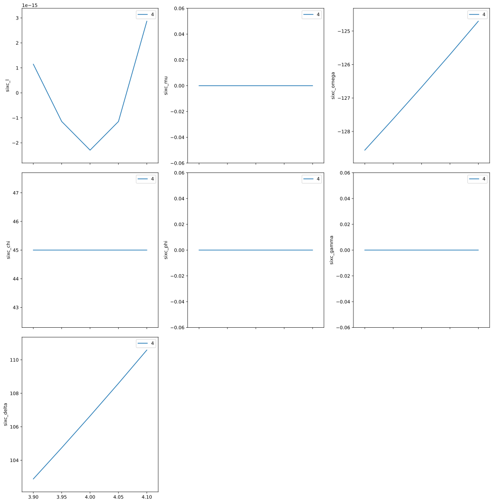

6-circle diffractometer example
===============================

The 6-circle diffractometer can be considered as a 4-circle
diffractometer with two additional rotations that rotate the sample and
detector separately.

.. figure:: resources/6-circle-diffractometer.jpg
   :alt: Huber 6-circle at APS

   Huber 6-circle at APS

--------------

Note: This example is available as a `Jupyter
notebook <https://jupyter.org/>`__ from the *hklpy* source code website:
https://github.com/bluesky/hklpy/tree/main/examples

Load the *hklpy* package (named *``hkl``*)
------------------------------------------

Since the *hklpy* package is a thin interface to the *hkl* library
(compiled C++ code), we need to **first** load the
*gobject-introspection* package (named *``gi``*) and name our required
code and version.

This is needed *every* time before the *hkl* package is first imported.

.. code:: ipython3

    import gi
    gi.require_version('Hkl', '5.0')

Setup the *E6C* diffractometer in *hklpy*
-----------------------------------------

In *hkl* *E6C* geometry
(https://people.debian.org/~picca/hkl/hkl.html#orge5e0490):

   E6C geometry

-  xrays incident on the :math:`\vec{x}` direction (1, 0, 0)

===== ======== ================ ============
axis  moves    rotation axis    vector
===== ======== ================ ============
mu    sample   :math:`\vec{z}`  ``[0 0 1]``
omega sample   :math:`-\vec{y}` ``[0 -1 0]``
chi   sample   :math:`\vec{x}`  ``[1 0 0]``
phi   sample   :math:`-\vec{y}` ``[0 -1 0]``
gamma detector :math:`\vec{z}`  ``[0 0 1]``
delta detector :math:`-\vec{y}` ``[0 -1 0]``
===== ======== ================ ============

Define *this* diffractometer
----------------------------

Create a python class that specifies the names of the real-space
positioners. We call it ``SixCircle`` here but that choice is arbitrary.
Pick any valid Python name not already in use.

The argument to the ``SixCircle`` class tells which *hklpy* base class
will be used. This sets the geometry. See the `hklpy diffractometers
documentation <https://blueskyproject.io/hklpy/master/diffract.html#hkl.diffract.Diffractometer.calc_class>`__
for a list of other choices.

In *hklpy*, the reciprocal-space axes are known as ``pseudo``
positioners while the real-space axes are known as ``real`` positioners.
For the real positioners, it is possible to use different names than the
canonical names used internally by the *hkl* library. That is not
covered here.

note: The keyword argument ``kind="hinted"`` is an indication that this
signal may be plotted.

This demo uses simulated motors. To use EPICS motors, import that
structure from *ophyd*:

.. code:: python

   from ophyd import EpicsMotor

Then, in the class, replace the real positioners with (substituting with
the correct EPICS PV for each motor):

.. code:: python

   mu = Cpt(EpicsMotor, "pv_prefix:m42", kind="hinted")
   omega = Cpt(EpicsMotor, "pv_prefix:m41", kind="hinted")
   chi = Cpt(EpicsMotor, "pv_prefix:m22", kind="hinted")
   phi = Cpt(EpicsMotor, "pv_prefix:m35", kind="hinted")
   gamma = Cpt(EpicsMotor, "pv_prefix:m7", kind="hinted")
   delta = Cpt(EpicsMotor, "pv_prefix:m8", kind="hinted")

and, **most important**, remove the ``def __init__()`` method. It is
only needed to define an initial position for the simulators. Otherwise,
this will move these EPICS motors to zero.

.. code:: ipython3

    from hkl.diffract import E6C
    from ophyd import PseudoSingle, SoftPositioner
    from ophyd import Component as Cpt
    
    class SixCircle(E6C):
        """
        Our 6-circle.  Eulerian.
        """
        # the reciprocal axes are called: pseudo in hklpy
        h = Cpt(PseudoSingle, '', kind="hinted")
        k = Cpt(PseudoSingle, '', kind="hinted")
        l = Cpt(PseudoSingle, '', kind="hinted")
    
        # the motor axes are called: real in hklpy
        mu = Cpt(SoftPositioner, kind="hinted")
        omega = Cpt(SoftPositioner, kind="hinted")
        chi = Cpt(SoftPositioner, kind="hinted")
        phi = Cpt(SoftPositioner, kind="hinted")
        gamma = Cpt(SoftPositioner, kind="hinted")
        delta = Cpt(SoftPositioner, kind="hinted")
    
        def __init__(self, *args, **kwargs):
            """Define an initial position for simulators."""
            super().__init__(*args, **kwargs)
    
            for p in self.real_positioners:
                p._set_position(0)  # give each a starting position

.. code:: ipython3

    sixc = SixCircle("", name="sixc")

Add a sample with a crystal structure
-------------------------------------

.. code:: ipython3

    from hkl.util import Lattice
    
    # add the sample to the calculation engine
    a0 = 5.431
    sixc.calc.new_sample(
        "silicon",
        lattice=Lattice(a=a0, b=a0, c=a0, alpha=90, beta=90, gamma=90)
        )

.. parsed-literal::

    HklSample(name='silicon', lattice=LatticeTuple(a=5.431, b=5.431, c=5.431, alpha=90.0, beta=90.0, gamma=90.0), ux=Parameter(name='None (internally: ux)', limits=(min=-180.0, max=180.0), value=0.0, fit=True, inverted=False, units='Degree'), uy=Parameter(name='None (internally: uy)', limits=(min=-180.0, max=180.0), value=0.0, fit=True, inverted=False, units='Degree'), uz=Parameter(name='None (internally: uz)', limits=(min=-180.0, max=180.0), value=0.0, fit=True, inverted=False, units='Degree'), U=array([[1., 0., 0.],
           [0., 1., 0.],
           [0., 0., 1.]]), UB=array([[ 1.15691131e+00, -7.08403864e-17, -7.08403864e-17],
           [ 0.00000000e+00,  1.15691131e+00, -7.08403864e-17],
           [ 0.00000000e+00,  0.00000000e+00,  1.15691131e+00]]), reflections=[])

Setup the UB orientation matrix using *hklpy*
---------------------------------------------

Define the crystal’s orientation on the diffractometer using the
2-reflection method described by `Busing & Levy, Acta Cryst 22 (1967)
457 <https://www.psi.ch/sites/default/files/import/sinq/zebra/PracticalsEN/1967-Busing-Levy-3-4-circle-Acta22.pdf>`__.

Choose the same wavelength X-rays for both reflections
~~~~~~~~~~~~~~~~~~~~~~~~~~~~~~~~~~~~~~~~~~~~~~~~~~~~~~

.. code:: ipython3

    sixc.calc.wavelength = 1.54 # Angstrom (8.0509 keV)

Find the first reflection and identify its Miller indices: (*hkl*)
~~~~~~~~~~~~~~~~~~~~~~~~~~~~~~~~~~~~~~~~~~~~~~~~~~~~~~~~~~~~~~~~~~

.. code:: ipython3

    r1 = sixc.calc.sample.add_reflection(
        4, 0, 0,
        position=sixc.calc.Position(
            delta=69.0966,
            omega=-145.451,
            chi=0,
            phi=0,
            mu=0,
            gamma=0,
        )
    )

Find the second reflection
~~~~~~~~~~~~~~~~~~~~~~~~~~

.. code:: ipython3

    r2 = sixc.calc.sample.add_reflection(
        0, 4, 0,
        position=sixc.calc.Position(
            delta=69.0966,
            omega=-145.451,
            chi=90,
            phi=0,
            mu=0,
            gamma=0,
        )
    )

Compute the *UB* orientation matrix
~~~~~~~~~~~~~~~~~~~~~~~~~~~~~~~~~~~

The ``compute_UB()`` method always returns 1. Ignore it.

.. code:: ipython3

    sixc.calc.sample.compute_UB(r1, r2)

.. parsed-literal::

    1

Report what we have setup
-------------------------

.. code:: ipython3

    import pyRestTable
    
    tbl = pyRestTable.Table()
    tbl.labels = "term value".split()
    tbl.addRow(("energy, keV", sixc.calc.energy))
    tbl.addRow(("wavelength, angstrom", sixc.calc.wavelength))
    tbl.addRow(("position", sixc.position))
    tbl.addRow(("sample name", sixc.sample_name.get()))
    tbl.addRow(("[U]", sixc.U.get()))
    tbl.addRow(("[UB]", sixc.UB.get()))
    tbl.addRow(("lattice", sixc.lattice.get()))
    print(tbl)
    
    print(f"sample\t{sixc.calc.sample}")

.. parsed-literal::

    ==================== ===================================================
    term                 value                                              
    ==================== ===================================================
    energy, keV          8.050922077922078                                  
    wavelength, angstrom 1.54                                               
    position             SixCirclePseudoPos(h=-0.0, k=0.0, l=0.0)           
    sample name          silicon                                            
    [U]                  [[-1.22173048e-05 -1.22173048e-05 -1.00000000e+00] 
                          [ 0.00000000e+00 -1.00000000e+00  1.22173048e-05] 
                          [-1.00000000e+00  1.49262536e-10  1.22173048e-05]]
    [UB]                 [[-1.41343380e-05 -1.41343380e-05 -1.15691131e+00] 
                          [ 0.00000000e+00 -1.15691131e+00  1.41343380e-05] 
                          [-1.15691131e+00  1.72683586e-10  1.41343380e-05]]
    lattice              [ 5.431  5.431  5.431 90.    90.    90.   ]        
    ==================== ===================================================
    
    sample	HklSample(name='silicon', lattice=LatticeTuple(a=5.431, b=5.431, c=5.431, alpha=90.0, beta=90.0, gamma=90.0), ux=Parameter(name='None (internally: ux)', limits=(min=-180.0, max=180.0), value=-45.0, fit=True, inverted=False, units='Degree'), uy=Parameter(name='None (internally: uy)', limits=(min=-180.0, max=180.0), value=-89.99901005102187, fit=True, inverted=False, units='Degree'), uz=Parameter(name='None (internally: uz)', limits=(min=-180.0, max=180.0), value=135.00000000427607, fit=True, inverted=False, units='Degree'), U=array([[-1.22173048e-05, -1.22173048e-05, -1.00000000e+00],
           [ 0.00000000e+00, -1.00000000e+00,  1.22173048e-05],
           [-1.00000000e+00,  1.49262536e-10,  1.22173048e-05]]), UB=array([[-1.41343380e-05, -1.41343380e-05, -1.15691131e+00],
           [ 0.00000000e+00, -1.15691131e+00,  1.41343380e-05],
           [-1.15691131e+00,  1.72683586e-10,  1.41343380e-05]]), reflections=[(h=4.0, k=0.0, l=0.0), (h=0.0, k=4.0, l=0.0)], reflection_measured_angles=array([[0.        , 1.57079633],
           [1.57079633, 0.        ]]), reflection_theoretical_angles=array([[0.        , 1.57079633],
           [1.57079633, 0.        ]]))

Check the orientation matrix
----------------------------

Perform checks with *forward* (hkl to angle) and *inverse* (angle to
hkl) computations to verify the diffractometer will move to the same
positions where the reflections were identified.

Constrain the motors to limited ranges
~~~~~~~~~~~~~~~~~~~~~~~~~~~~~~~~~~~~~~

-  allow for slight roundoff errors
-  keep ``delta`` in the positive range
-  keep ``omega`` in the negative range
-  keep ``gamma``, ``mu``, & ``phi`` fixed at zero

.. code:: ipython3

    sixc.calc["delta"].limits = (-0.001, 180)
    sixc.calc["omega"].limits = (-180, 0.001)
    
    for nm in "gamma mu phi".split():
        getattr(sixc, nm).move(0)
        sixc.calc[nm].fit = False
        sixc.calc[nm].value = 0
        sixc.calc[nm].limits = (0, 0)
    sixc.engine.mode = "constant_phi_vertical"

Check the inverse calculation: (400)
~~~~~~~~~~~~~~~~~~~~~~~~~~~~~~~~~~~~

.. code:: ipython3

    sol = sixc.inverse((0, -145.451, 0, 0, 0, 69.0966))
    print("(4 0 0) ?", f"{sol.h:.2f}", f"{sol.k:.2f}", f"{sol.l:.2f}")

.. parsed-literal::

    (4 0 0) ? 4.00 0.00 0.00

Check the inverse calculation: (040)
~~~~~~~~~~~~~~~~~~~~~~~~~~~~~~~~~~~~

.. code:: ipython3

    sol = sixc.inverse((0, -145.451, 90, 0, 0, 69.0966))
    print("(0 4 0) ?", f"{sol.h:.2f}", f"{sol.k:.2f}", f"{sol.l:.2f}")

.. parsed-literal::

    (0 4 0) ? 0.00 4.00 0.00

Check the forward calculation: (400)
~~~~~~~~~~~~~~~~~~~~~~~~~~~~~~~~~~~~

.. code:: ipython3

    sol = sixc.forward((4, 0, 0))
    print(
        "(400) :", 
        f"tth={sol.delta:.4f}", 
        f"omega={sol.omega:.4f}", 
        f"chi={sol.chi:.4f}", 
        f"phi={sol.phi:.4f}",
        f"mu={sol.mu:.4f}",
        f"gamma={sol.gamma:.4f}",
        )

.. parsed-literal::

    (400) : tth=69.0985 omega=-145.4500 chi=0.0000 phi=0.0000 mu=0.0000 gamma=0.0000

Check the forward calculation: (040)
~~~~~~~~~~~~~~~~~~~~~~~~~~~~~~~~~~~~

.. code:: ipython3

    sol = sixc.forward((0, 4, 0))
    print(
        "(040) :", 
        f"tth={sol.delta:.4f}", 
        f"omega={sol.omega:.4f}", 
        f"chi={sol.chi:.4f}", 
        f"phi={sol.phi:.4f}",
        f"mu={sol.mu:.4f}",
        f"gamma={sol.gamma:.4f}",
        )

.. parsed-literal::

    (040) : tth=69.0985 omega=-145.4500 chi=90.0000 phi=0.0000 mu=0.0000 gamma=0.0000

Check the forward calculation: (440)
~~~~~~~~~~~~~~~~~~~~~~~~~~~~~~~~~~~~

.. code:: ipython3

    sol = sixc.forward((4, 4, 0))
    print(
        "(440) :", 
        f"tth={sol.delta:.4f}", 
        f"omega={sol.omega:.4f}", 
        f"chi={sol.chi:.4f}", 
        f"phi={sol.phi:.4f}",
        f"mu={sol.mu:.4f}",
        f"gamma={sol.gamma:.4f}",
        )

.. parsed-literal::

    (440) : tth=106.6471 omega=-126.6755 chi=45.0000 phi=0.0000 mu=0.0000 gamma=0.0000

Scan in reciprocal space using Bluesky
--------------------------------------

To scan with Bluesky, we need more setup.

.. code:: ipython3

    %matplotlib inline
    
    from bluesky import RunEngine
    from bluesky import SupplementalData
    from bluesky.callbacks.best_effort import BestEffortCallback
    import bluesky.plans as bp
    import bluesky.plan_stubs as bps
    import databroker
    import matplotlib.pyplot as plt
    
    plt.ion()
    
    bec = BestEffortCallback()
    db = databroker.temp().v1
    sd = SupplementalData()
    
    RE = RunEngine({})
    RE.md = {}
    RE.preprocessors.append(sd)
    RE.subscribe(db.insert)
    RE.subscribe(bec)

.. parsed-literal::

    1

(*h00*) scan near (400)
~~~~~~~~~~~~~~~~~~~~~~~

.. code:: ipython3

    RE(bp.scan([], sixc.h, 3.9, 4.1, 5))

.. parsed-literal::

    
    
    Transient Scan ID: 1     Time: 2020-12-09 00:07:58
    Persistent Unique Scan ID: 'f071deae-ca35-41aa-9c25-7bca0233748b'
    New stream: 'primary'
    +-----------+------------+------------+
    |   seq_num |       time |     sixc_h |
    +-----------+------------+------------+
    |         1 | 00:07:58.7 |      3.900 |
    |         2 | 00:07:58.7 |      3.950 |
    |         3 | 00:07:58.7 |      4.000 |
    |         4 | 00:07:58.8 |      4.050 |
    |         5 | 00:07:58.8 |      4.100 |
    +-----------+------------+------------+
    generator scan ['f071deae'] (scan num: 1)
    
    
    

.. parsed-literal::

    ('f071deae-ca35-41aa-9c25-7bca0233748b',)

chi scan from (400) to (040)
~~~~~~~~~~~~~~~~~~~~~~~~~~~~

.. code:: ipython3

    RE(bp.scan([sixc.chi, sixc.h, sixc.k, sixc.l], sixc.chi, 0, 90, 10))

.. parsed-literal::

    
    
    Transient Scan ID: 2     Time: 2020-12-09 00:07:59
    Persistent Unique Scan ID: '4f396a5a-358a-4e43-8f9c-5ce95f1afc67'
    New stream: 'primary'
    +-----------+------------+------------+------------+------------+------------+
    |   seq_num |       time |   sixc_chi |     sixc_h |     sixc_k |     sixc_l |
    +-----------+------------+------------+------------+------------+------------+
    |         1 | 00:07:59.2 |      0.000 |      4.100 |      0.000 |      0.000 |
    |         2 | 00:07:59.5 |     10.000 |      4.038 |      0.712 |     -0.000 |
    |         3 | 00:07:59.7 |     20.000 |      3.853 |      1.402 |     -0.000 |
    |         4 | 00:07:59.9 |     30.000 |      3.551 |      2.050 |     -0.000 |
    |         5 | 00:08:00.2 |     40.000 |      3.141 |      2.635 |     -0.000 |
    |         6 | 00:08:00.4 |     50.000 |      2.635 |      3.141 |     -0.000 |
    |         7 | 00:08:00.6 |     60.000 |      2.050 |      3.551 |     -0.000 |
    |         8 | 00:08:00.9 |     70.000 |      1.402 |      3.853 |     -0.000 |
    |         9 | 00:08:01.1 |     80.000 |      0.712 |      4.038 |     -0.000 |
    |        10 | 00:08:01.3 |     90.000 |      0.000 |      4.100 |      0.000 |
    +-----------+------------+------------+------------+------------+------------+
    generator scan ['4f396a5a'] (scan num: 2)
    
    
    

.. parsed-literal::

    ('4f396a5a-358a-4e43-8f9c-5ce95f1afc67',)

(*0k0*) scan near (040)
~~~~~~~~~~~~~~~~~~~~~~~

.. code:: ipython3

    RE(bp.scan([], sixc.k, 3.9, 4.1, 5))

.. parsed-literal::

    
    
    Transient Scan ID: 3     Time: 2020-12-09 00:08:02
    Persistent Unique Scan ID: 'a1ee3d0f-4860-4b43-a30b-c7a4fa4c8f4d'
    New stream: 'primary'
    +-----------+------------+------------+
    |   seq_num |       time |     sixc_k |
    +-----------+------------+------------+
    |         1 | 00:08:02.5 |      3.900 |
    |         2 | 00:08:02.5 |      3.950 |
    |         3 | 00:08:02.5 |      4.000 |
    |         4 | 00:08:02.5 |      4.050 |
    |         5 | 00:08:02.5 |      4.100 |
    +-----------+------------+------------+
    generator scan ['a1ee3d0f'] (scan num: 3)
    
    
    

.. parsed-literal::

    ('a1ee3d0f-4860-4b43-a30b-c7a4fa4c8f4d',)

(*hk0*) scan near (440)
~~~~~~~~~~~~~~~~~~~~~~~

.. code:: ipython3

    RE(bp.scan([], sixc.h, 3.9, 4.1, sixc.k, 3.9, 4.1, 5))

.. parsed-literal::

    
    
    Transient Scan ID: 4     Time: 2020-12-09 00:08:02
    Persistent Unique Scan ID: 'e8f4b12d-1d3c-4481-af0b-2d638cd8f493'
    New stream: 'primary'
    +-----------+------------+------------+------------+------------+------------+------------+------------+------------+------------+------------+
    |   seq_num |       time |     sixc_h |     sixc_k |     sixc_l |    sixc_mu | sixc_omega |   sixc_chi |   sixc_phi | sixc_gamma | sixc_delta |
    +-----------+------------+------------+------------+------------+------------+------------+------------+------------+------------+------------+
    |         1 | 00:08:03.1 |      3.900 |      3.900 |      0.000 |      0.000 |   -128.558 |     45.000 |      0.000 |      0.000 |    102.883 |
    |         2 | 00:08:04.3 |      3.950 |      3.950 |     -0.000 |      0.000 |   -127.627 |     45.000 |      0.000 |      0.000 |    104.745 |
    |         3 | 00:08:05.5 |      4.000 |      4.000 |     -0.000 |      0.000 |   -126.675 |     45.000 |      0.000 |      0.000 |    106.647 |
    |         4 | 00:08:06.7 |      4.050 |      4.050 |     -0.000 |      0.000 |   -125.703 |     45.000 |      0.000 |      0.000 |    108.593 |
    |         5 | 00:08:08.0 |      4.100 |      4.100 |      0.000 |      0.000 |   -124.706 |     45.000 |      0.000 |      0.000 |    110.585 |
    +-----------+------------+------------+------------+------------+------------+------------+------------+------------+------------+------------+
    generator scan ['e8f4b12d'] (scan num: 4)
    
    
    

.. parsed-literal::

    ('e8f4b12d-1d3c-4481-af0b-2d638cd8f493',)

