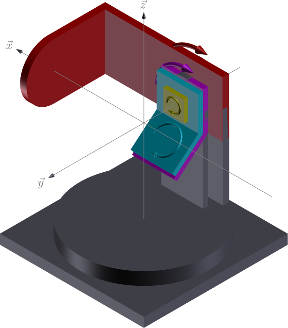
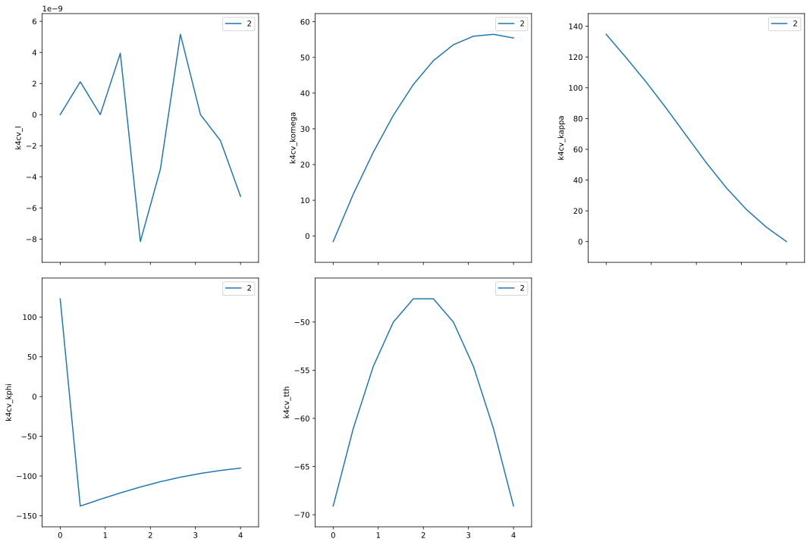
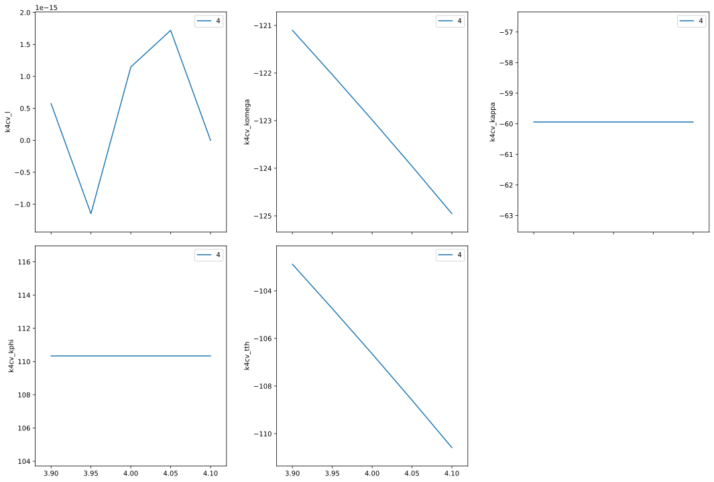

4-circle kappa diffractometer example
=====================================

The kappa geometry replaces the traditional :math:`\chi`-ring on a
4-circle diffractometer with an alternative kappa stage that holds the
phi stage. The kappa stage is tilted at angle :math:`\alpha` (typically
50 degrees) from the :math:`\omega` stage.

--------------

Note: This example is available as a `Jupyter
notebook <https://jupyter.org/>`__ from the *hklpy* source code website:
https://github.com/bluesky/hklpy/tree/main/examples

Load the *hklpy* package (named *``hkl``*)
------------------------------------------

Since the *hklpy* package is a thin interface to the *hkl* library
(compiled C++ code), we need to **first** load the
*gobject-introspection* package (named *``gi``*) and name our required
code and version.

This is needed *every* time before the *hkl* package is first imported.

.. code:: ipython3

    import gi
    gi.require_version('Hkl', '5.0')

Setup the *K4CV* diffractometer in *hklpy*
------------------------------------------

In *hkl* *K4CV* geometry
(https://people.debian.org/~picca/hkl/hkl.html#org723c5b9):

   K4CV geometry

For this geometry there is a special parameter :math:`\alpha`, the angle
between the kappa rotation axis and the :math:`\vec{y}` direction.

====== ======== ================ =======================
axis   moves    rotation axis    vector
====== ======== ================ =======================
komega sample   :math:`-\vec{y}` ``[0 -1 0]``
kappa  sample   :math:`\vec{x}`  ``[0 -0.6428 -0.7660]``
kphi   sample   :math:`-\vec{y}` ``[0 -1 0]``
tth    detector :math:`-\vec{y}` ``[0 -1 0]``
====== ======== ================ =======================

Define *this* diffractometer
----------------------------

Create a python class that specifies the names of the real-space
positioners. We call it ``KappaFourCircle`` here but that choice is
arbitrary. Pick any valid Python name not already in use.

The argument to the ``KappaFourCircle`` class tells which *hklpy* base
class will be used. This sets the geometry. See the `hklpy
diffractometers
documentation <https://blueskyproject.io/hklpy/master/diffract.html#hkl.diffract.Diffractometer.calc_class>`__
for a list of other choices.

In *hklpy*, the reciprocal-space axes are known as ``pseudo``
positioners while the real-space axes are known as ``real`` positioners.
For the real positioners, it is possible to use different names than the
canonical names used internally by the *hkl* library. That is not
covered here.

note: The keyword argument ``kind="hinted"`` is an indication that this
signal may be plotted.

This demo uses simulated motors. To use EPICS motors, import that
structure from *ophyd*:

.. code:: python

   from ophyd import EpicsMotor

Then, in the class, replace the real positioners with (substituting with
the correct EPICS PV for each motor):

.. code:: python

   komega = Cpt(EpicsMotor, "pv_prefix:m41", kind="hinted")
   kappa = Cpt(EpicsMotor, "pv_prefix:m22", kind="hinted")
   kphi = Cpt(EpicsMotor, "pv_prefix:m35", kind="hinted")
   tth = Cpt(EpicsMotor, "pv_prefix:m7", kind="hinted")

and, **most important**, remove the ``def __init__()`` method. It is
only needed to define an initial position for the simulators. Otherwise,
this will move these EPICS motors to zero.

.. code:: ipython3

    from hkl.diffract import K4CV
    from ophyd import PseudoSingle, SoftPositioner
    from ophyd import Component as Cpt
    
    class KappaFourCircle(K4CV):
        """
        Our kappa 4-circle.  Eulerian, vertical scattering orientation.
        """
        # the reciprocal axes are called: pseudo in hklpy
        h = Cpt(PseudoSingle, '', kind="hinted")
        k = Cpt(PseudoSingle, '', kind="hinted")
        l = Cpt(PseudoSingle, '', kind="hinted")
    
        # the motor axes are called: real in hklpy
        komega = Cpt(SoftPositioner, kind="hinted")
        kappa = Cpt(SoftPositioner, kind="hinted")
        kphi = Cpt(SoftPositioner, kind="hinted")
        tth = Cpt(SoftPositioner, kind="hinted")
    
        def __init__(self, *args, **kwargs):
            """Define an initial position for simulators."""
            super().__init__(*args, **kwargs)
    
            for p in self.real_positioners:
                p._set_position(0)  # give each a starting position

.. code:: ipython3

    k4cv = KappaFourCircle("", name="k4cv")

Add a sample with a crystal structure
-------------------------------------

.. code:: ipython3

    from hkl.util import Lattice
    
    # add the sample to the calculation engine
    a0 = 5.431
    k4cv.calc.new_sample(
        "silicon",
        lattice=Lattice(a=a0, b=a0, c=a0, alpha=90, beta=90, gamma=90)
        )

.. parsed-literal::

    HklSample(name='silicon', lattice=LatticeTuple(a=5.431, b=5.431, c=5.431, alpha=90.0, beta=90.0, gamma=90.0), ux=Parameter(name='None (internally: ux)', limits=(min=-180.0, max=180.0), value=0.0, fit=True, inverted=False, units='Degree'), uy=Parameter(name='None (internally: uy)', limits=(min=-180.0, max=180.0), value=0.0, fit=True, inverted=False, units='Degree'), uz=Parameter(name='None (internally: uz)', limits=(min=-180.0, max=180.0), value=0.0, fit=True, inverted=False, units='Degree'), U=array([[1., 0., 0.],
           [0., 1., 0.],
           [0., 0., 1.]]), UB=array([[ 1.15691131e+00, -7.08403864e-17, -7.08403864e-17],
           [ 0.00000000e+00,  1.15691131e+00, -7.08403864e-17],
           [ 0.00000000e+00,  0.00000000e+00,  1.15691131e+00]]), reflections=[])

Setup the UB orientation matrix using *hklpy*
---------------------------------------------

Define the crystal’s orientation on the diffractometer using the
2-reflection method described by `Busing & Levy, Acta Cryst 22 (1967)
457 <https://www.psi.ch/sites/default/files/import/sinq/zebra/PracticalsEN/1967-Busing-Levy-3-4-circle-Acta22.pdf>`__.

Choose the same wavelength X-rays for both reflections
~~~~~~~~~~~~~~~~~~~~~~~~~~~~~~~~~~~~~~~~~~~~~~~~~~~~~~

.. code:: ipython3

    k4cv.calc.wavelength = 1.54 # Angstrom (8.0509 keV)

Find the first reflection and identify its Miller indices: (*hkl*)
~~~~~~~~~~~~~~~~~~~~~~~~~~~~~~~~~~~~~~~~~~~~~~~~~~~~~~~~~~~~~~~~~~

.. code:: ipython3

    r1 = k4cv.calc.sample.add_reflection(
        4, 0, 0,
        position=k4cv.calc.Position(
            tth=-69.0966,
            komega=55.4507,
            kappa=0,
            kphi=-90,
        )
    )

Find the second reflection
~~~~~~~~~~~~~~~~~~~~~~~~~~

.. code:: ipython3

    r2 = k4cv.calc.sample.add_reflection(
        0, 4, 0,
        position=k4cv.calc.Position(
            tth=-69.0966,
            komega=-1.5950,
            kappa=134.7568,
            kphi=123.3554
        )
    )

Compute the *UB* orientation matrix
~~~~~~~~~~~~~~~~~~~~~~~~~~~~~~~~~~~

The ``compute_UB()`` method always returns 1. Ignore it.

.. code:: ipython3

    k4cv.calc.sample.compute_UB(r1, r2)

.. parsed-literal::

    1

Report what we have setup
-------------------------

.. code:: ipython3

    import pyRestTable
    
    tbl = pyRestTable.Table()
    tbl.labels = "term value".split()
    tbl.addRow(("energy, keV", k4cv.calc.energy))
    tbl.addRow(("wavelength, angstrom", k4cv.calc.wavelength))
    tbl.addRow(("position", k4cv.position))
    tbl.addRow(("sample name", k4cv.sample_name.get()))
    tbl.addRow(("[U]", k4cv.U.get()))
    tbl.addRow(("[UB]", k4cv.UB.get()))
    tbl.addRow(("lattice", k4cv.lattice.get()))
    print(tbl)
    
    print(f"sample\t{k4cv.calc.sample}")

.. parsed-literal::

    ==================== ===================================================
    term                 value                                              
    ==================== ===================================================
    energy, keV          8.050922077922078                                  
    wavelength, angstrom 1.54                                               
    position             KappaFourCirclePseudoPos(h=0.0, k=-0.0, l=0.0)     
    sample name          silicon                                            
    [U]                  [[ 1.74532925e-05 -6.22695871e-06 -1.00000000e+00] 
                          [ 0.00000000e+00 -1.00000000e+00  6.22695872e-06] 
                          [-1.00000000e+00 -1.08680932e-10 -1.74532925e-05]]
    [UB]                 [[ 2.01919115e-05 -7.20403894e-06 -1.15691131e+00] 
                          [ 0.00000000e+00 -1.15691131e+00  7.20403894e-06] 
                          [-1.15691131e+00 -1.25734128e-10 -2.01919115e-05]]
    lattice              [ 5.431  5.431  5.431 90.    90.    90.   ]        
    ==================== ===================================================
    
    sample	HklSample(name='silicon', lattice=LatticeTuple(a=5.431, b=5.431, c=5.431, alpha=90.0, beta=90.0, gamma=90.0), ux=Parameter(name='None (internally: ux)', limits=(min=-180.0, max=180.0), value=-160.36469500932463, fit=True, inverted=False, units='Degree'), uy=Parameter(name='None (internally: uy)', limits=(min=-180.0, max=180.0), value=-89.99893826046727, fit=True, inverted=False, units='Degree'), uz=Parameter(name='None (internally: uz)', limits=(min=-180.0, max=180.0), value=19.635304987561902, fit=True, inverted=False, units='Degree'), U=array([[ 1.74532925e-05, -6.22695871e-06, -1.00000000e+00],
           [ 0.00000000e+00, -1.00000000e+00,  6.22695872e-06],
           [-1.00000000e+00, -1.08680932e-10, -1.74532925e-05]]), UB=array([[ 2.01919115e-05, -7.20403894e-06, -1.15691131e+00],
           [ 0.00000000e+00, -1.15691131e+00,  7.20403894e-06],
           [-1.15691131e+00, -1.25734128e-10, -2.01919115e-05]]), reflections=[(h=4.0, k=0.0, l=0.0), (h=0.0, k=4.0, l=0.0)], reflection_measured_angles=array([[0.        , 1.57081338],
           [1.57081338, 0.        ]]), reflection_theoretical_angles=array([[0.        , 1.57079633],
           [1.57079633, 0.        ]]))

Check the orientation matrix
----------------------------

Perform checks with *forward* (hkl to angle) and *inverse* (angle to
hkl) computations to verify the diffractometer will move to the same
positions where the reflections were identified.

Use ``bissector`` mode
~~~~~~~~~~~~~~~~~~~~~~

where ``tth`` = 2\*\ ``omega``

.. code:: ipython3

    k4cv.calc.engine.mode = "bissector"

Check the inverse calculation: (400)
~~~~~~~~~~~~~~~~~~~~~~~~~~~~~~~~~~~~

.. code:: ipython3

    sol = k4cv.inverse((55.4507, 0, -90, -69.0966))
    print("(4 0 0) ?", f"{sol.h:.2f}", f"{sol.k:.2f}", f"{sol.l:.2f}")

.. parsed-literal::

    (4 0 0) ? 4.00 -0.00 -0.00

Check the inverse calculation: (040)
~~~~~~~~~~~~~~~~~~~~~~~~~~~~~~~~~~~~

.. code:: ipython3

    sol = k4cv.inverse((-1.5950, 134.7568, 123.3554, -69.0966))
    print("(0 4 0) ?", f"{sol.h:.2f}", f"{sol.k:.2f}", f"{sol.l:.2f}")

.. parsed-literal::

    (0 4 0) ? -0.00 4.00 0.00

Check the forward calculation: (400)
~~~~~~~~~~~~~~~~~~~~~~~~~~~~~~~~~~~~

.. code:: ipython3

    sol = k4cv.forward((4, 0, 0))
    print(
        "(400) :", 
        f"tth={sol.tth:.4f}", 
        f"komega={sol.komega:.4f}", 
        f"kappa={sol.kappa:.4f}", 
        f"kphi={sol.kphi:.4f}"
        )

.. parsed-literal::

    (400) : tth=-69.0985 komega=55.4507 kappa=0.0000 kphi=-90.0010

Check the forward calculation: (040)
~~~~~~~~~~~~~~~~~~~~~~~~~~~~~~~~~~~~

.. code:: ipython3

    sol = k4cv.forward((0, 4, 0))
    print(
        "(040) :", 
        f"tth={sol.tth:.4f}", 
        f"komega={sol.komega:.4f}", 
        f"kappa={sol.kappa:.4f}", 
        f"kphi={sol.kphi:.4f}"
        )

.. parsed-literal::

    (040) : tth=-69.0985 komega=-1.5939 kappa=134.7551 kphi=-57.3291

Check the forward calculation: (440)
~~~~~~~~~~~~~~~~~~~~~~~~~~~~~~~~~~~~

.. code:: ipython3

    sol = k4cv.forward((4, 4, 0))
    print(
        "(440) :", 
        f"tth={sol.tth:.4f}", 
        f"komega={sol.komega:.4f}", 
        f"kappa={sol.kappa:.4f}", 
        f"kphi={sol.kphi:.4f}"
        )

.. parsed-literal::

    (440) : tth=-106.6471 komega=16.3379 kappa=59.9415 kphi=-110.3392

Scan in reciprocal space using Bluesky
--------------------------------------

To scan with Bluesky, we need more setup.

.. code:: ipython3

    %matplotlib inline
    
    from bluesky import RunEngine
    from bluesky import SupplementalData
    from bluesky.callbacks.best_effort import BestEffortCallback
    import bluesky.plans as bp
    import bluesky.plan_stubs as bps
    import databroker
    import matplotlib.pyplot as plt
    
    plt.ion()
    
    bec = BestEffortCallback()
    db = databroker.temp().v1
    sd = SupplementalData()
    
    RE = RunEngine({})
    RE.md = {}
    RE.preprocessors.append(sd)
    RE.subscribe(db.insert)
    RE.subscribe(bec)

.. parsed-literal::

    1

(*h00*) scan near (400)
~~~~~~~~~~~~~~~~~~~~~~~

.. code:: ipython3

    RE(bp.scan([], k4cv.h, 3.9, 4.1, 5))

.. parsed-literal::

    
    
    Transient Scan ID: 1     Time: 2020-12-09 01:26:09
    Persistent Unique Scan ID: 'c4e101a0-4519-49db-b018-95f85a207b89'
    New stream: 'primary'
    +-----------+------------+------------+
    |   seq_num |       time |     k4cv_h |
    +-----------+------------+------------+
    |         1 | 01:26:09.1 |      3.900 |
    |         2 | 01:26:09.2 |      3.950 |
    |         3 | 01:26:09.3 |      4.000 |
    |         4 | 01:26:09.4 |      4.050 |
    |         5 | 01:26:09.4 |      4.100 |
    +-----------+------------+------------+
    generator scan ['c4e101a0'] (scan num: 1)
    
    
    

.. parsed-literal::

    ('c4e101a0-4519-49db-b018-95f85a207b89',)

chi scan from (400) to (040)
~~~~~~~~~~~~~~~~~~~~~~~~~~~~

.. code:: ipython3

    RE(bp.scan([k4cv.komega,k4cv.kappa,k4cv.kphi, k4cv.tth, k4cv.h, k4cv.k, k4cv.l], k4cv.h, 4, 0, k4cv.k, 0, 4, 10))

.. parsed-literal::

    
    
    Transient Scan ID: 2     Time: 2020-12-09 01:26:09
    Persistent Unique Scan ID: '9a06c68b-aa82-489d-90ae-533c6049218b'
    New stream: 'primary'
    +-----------+------------+------------+------------+------------+-------------+------------+------------+------------+
    |   seq_num |       time |     k4cv_h |     k4cv_k |     k4cv_l | k4cv_komega | k4cv_kappa |  k4cv_kphi |   k4cv_tth |
    +-----------+------------+------------+------------+------------+-------------+------------+------------+------------+
    |         1 | 01:26:10.0 |      4.000 |     -0.000 |     -0.000 |      55.451 |     -0.000 |    -90.001 |    -69.099 |
    |         2 | 01:26:10.7 |      3.556 |      0.444 |     -0.000 |      56.473 |      9.305 |    -92.995 |    -61.065 |
    |         3 | 01:26:11.4 |      3.111 |      0.889 |      0.000 |      55.945 |     20.863 |    -96.750 |    -54.612 |
    |         4 | 01:26:12.0 |      2.667 |      1.333 |      0.000 |      53.570 |     34.906 |   -101.426 |    -50.011 |
    |         5 | 01:26:12.8 |      2.222 |      1.778 |     -0.000 |      49.086 |     51.202 |   -107.119 |    -47.592 |
    |         6 | 01:26:13.5 |      1.778 |      2.222 |     -0.000 |      42.420 |     68.872 |   -113.785 |    -47.592 |
    |         7 | 01:26:14.1 |      1.333 |      2.667 |      0.000 |      33.757 |     86.675 |   -121.238 |    -50.011 |
    |         8 | 01:26:14.7 |      0.889 |      3.111 |      0.000 |      23.427 |    103.647 |   -129.267 |    -54.612 |
    |         9 | 01:26:15.3 |      0.444 |      3.556 |      0.000 |      11.673 |    119.520 |   -137.793 |    -61.065 |
    |        10 | 01:26:16.0 |     -0.000 |      4.000 |      0.000 |      -1.595 |    134.757 |    122.954 |    -69.099 |
    +-----------+------------+------------+------------+------------+-------------+------------+------------+------------+
    generator scan ['9a06c68b'] (scan num: 2)
    
    
    

.. parsed-literal::

    ('9a06c68b-aa82-489d-90ae-533c6049218b',)

(*0k0*) scan near (040)
~~~~~~~~~~~~~~~~~~~~~~~

.. code:: ipython3

    RE(bp.scan([], k4cv.k, 3.9, 4.1, 5))

.. parsed-literal::

    
    
    Transient Scan ID: 3     Time: 2020-12-09 01:26:18
    Persistent Unique Scan ID: 'b0b83e7f-d8b3-4cb9-95e4-83d6ddce81b5'
    New stream: 'primary'
    +-----------+------------+------------+
    |   seq_num |       time |     k4cv_k |
    +-----------+------------+------------+
    |         1 | 01:26:18.3 |      3.900 |
    |         2 | 01:26:18.3 |      3.950 |
    |         3 | 01:26:18.3 |      4.000 |
    |         4 | 01:26:18.3 |      4.050 |
    |         5 | 01:26:18.4 |      4.100 |
    +-----------+------------+------------+
    generator scan ['b0b83e7f'] (scan num: 3)
    
    
    

.. parsed-literal::

    ('b0b83e7f-d8b3-4cb9-95e4-83d6ddce81b5',)

(*hk0*) scan near (440)
~~~~~~~~~~~~~~~~~~~~~~~

.. code:: ipython3

    RE(bp.scan([], k4cv.h, 3.9, 4.1, k4cv.k, 3.9, 4.1, 5))

.. parsed-literal::

    
    
    Transient Scan ID: 4     Time: 2020-12-09 01:26:18
    Persistent Unique Scan ID: '0b2d4091-081d-4583-8f81-fe8871f35840'
    New stream: 'primary'
    +-----------+------------+------------+------------+------------+-------------+------------+------------+------------+
    |   seq_num |       time |     k4cv_h |     k4cv_k |     k4cv_l | k4cv_komega | k4cv_kappa |  k4cv_kphi |   k4cv_tth |
    +-----------+------------+------------+------------+------------+-------------+------------+------------+------------+
    |         1 | 01:26:18.9 |      3.900 |      3.900 |      0.000 |    -121.103 |    -59.941 |    110.338 |   -102.883 |
    |         2 | 01:26:19.5 |      3.950 |      3.950 |     -0.000 |    -122.034 |    -59.941 |    110.338 |   -104.745 |
    |         3 | 01:26:20.2 |      4.000 |      4.000 |      0.000 |    -122.985 |    -59.941 |    110.338 |   -106.647 |
    |         4 | 01:26:20.9 |      4.050 |      4.050 |      0.000 |    -123.958 |    -59.941 |    110.338 |   -108.593 |
    |         5 | 01:26:21.6 |      4.100 |      4.100 |      0.000 |    -124.954 |    -59.941 |    110.338 |   -110.585 |
    +-----------+------------+------------+------------+------------+-------------+------------+------------+------------+
    generator scan ['0b2d4091'] (scan num: 4)
    
    
    

.. parsed-literal::

    ('0b2d4091-081d-4583-8f81-fe8871f35840',)

